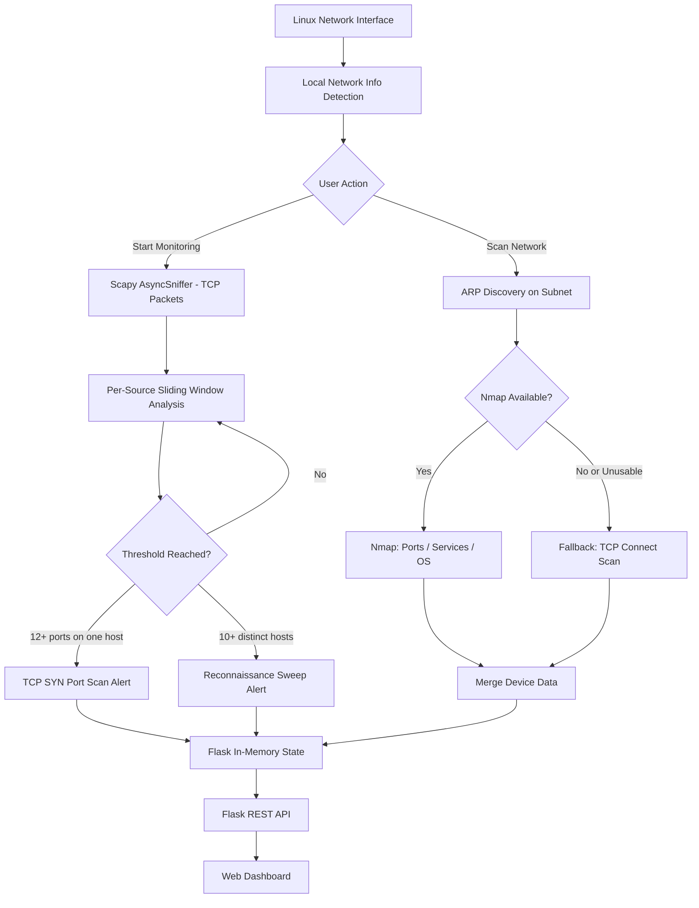

<div align="center">

# NetSentinel-XDR

**Linux-Based Network Monitoring and Security Detection System**


</div>

<p align="center">
NetSentinel-XDR is a lightweight Linux-based network monitoring and security detection tool that provides local network device discovery, port and service scanning, and real-time detection of TCP SYN port scans and host sweep reconnaissance, all through a self-contained web dashboard.
</p>

---

> This is an educational / academic project. It is not a replacement for a commercial IDS, SIEM, NDR, or XDR platform. See [Project Scope and Limitations](#project-scope-and-limitations) before relying on it for anything beyond learning and lab use.

---

## Table of Contents

- [Project Overview](#project-overview)
- [Key Features](#key-features)
- [How It Works](#how-it-works)
- [System Architecture](#system-architecture)
- [Technology Stack](#technology-stack)
- [Requirements](#requirements)
- [Installation Guide](#installation-guide)
- [Running the Application](#running-the-application)
- [API Reference](#api-reference)
- [Detection Logic](#detection-logic)
- [Project Scope and Limitations](#project-scope-and-limitations)
- [Possible Future Improvements](#possible-future-improvements)
- [Team](#team)

---

## Project Overview

NetSentinel-XDR combines a small number of well-defined capabilities into a single lightweight Linux application:

```
Network Visibility + Network Scanning + Packet Monitoring + Reconnaissance Detection + Security Alerts + Web Dashboard
```

**What it is**
A Flask backend (`app.py`) that coordinates a scanning/monitoring engine (`scanner.py`), exposes a small JSON API, and serves a single-page dashboard (`index.html` + `style.css`) for viewing results in a browser.

**What problem it addresses**
On a local network, it is often useful to quickly answer: which devices are present, what ports/services they expose, and whether any host on the network is currently behaving like it is scanning others. NetSentinel-XDR answers these questions from a single machine without requiring a dedicated monitoring appliance.

**Who it is for**
Students, cybersecurity learners, and small home/lab environments who want a hands-on, readable example of network discovery and basic intrusion-style detection built in Python.

**What makes it different**
It intentionally stays small: no database, no persistent storage, no external monitoring services — everything lives in memory for the current run of the process, and the logic in `scanner.py` is short enough to read end-to-end.

**Current scope**
Single-machine, single-network-segment, single Python process. State exists only while the Flask server is running.

---

## Key Features

| Feature | Description | Implementation |
|---|---|---|
| Local network detection | Automatically identifies the active default network interface and its IPv4 subnet | `ip route show default` and `ip -o -4 addr show` parsed in `scanner.get_local_network_info()` |
| Device discovery | Discovers live hosts on the local subnet | ARP request/reply via Scapy (`srp`) in `scanner.discover_devices()` |
| Open port scanning | Identifies open TCP ports on discovered/scanned hosts | Nmap (`-Pn -sV -O`) when available, with a raw TCP `connect()` fallback |
| Service detection | Identifies the service running on an open port | Nmap service/version detection, or `socket.getservbyport()` name lookup in fallback mode |
| OS fingerprinting (best-effort) | Attempts to identify the host operating system | Nmap OS detection (`-O`), only accepted when Nmap reports match accuracy of 85% or higher; not available in fallback mode |
| Hostname resolution | Resolves a reverse DNS name for a host | `socket.gethostbyaddr()` |
| MAC address discovery | Associates a MAC address with a discovered IP | Read from ARP replies, Nmap XML output, or `ip neigh show` |
| Online/offline status | Tracks whether a host responded during discovery or scanning | Set from ARP replies, Nmap host status, or ICMP ping in fallback mode |
| Single-target scan | Scans one specific IP address on demand | `scanner.scan_target()`, reachable via the `/api/scan` API with a `target` field |
| Full network scan | Runs ARP discovery across the whole local subnet, then scans each discovered host | Triggered by the "Scan Network" button in the dashboard, which calls `/api/scan` with no target |
| Real-time packet monitoring | Passively sniffs TCP traffic on the active interface | Scapy `AsyncSniffer` in `scanner.NetworkMonitor` |
| TCP SYN port-scan detection | Flags a source IP that probes many distinct ports on one destination within a short time window | Sliding 8-second window, alert at 12 or more distinct destination ports to the same host |
| Reconnaissance sweep detection | Flags a source IP that contacts many distinct hosts within a short time window | Same sliding window, alert at 10 or more distinct destination hosts |
| Alert cooldown | Prevents the same alert from repeating continuously | 60-second cooldown per (source, destination, detection type) key |
| Security alert feed | Lists generated alerts with severity, source, target, and details | `/api/alerts` endpoint, rendered in the dashboard alert list |
| Scan history | Keeps a record of recent discovery and target scans for the current session | In-memory `deque` (`scan_history`), served via `/api/scan/history` |
| RAM-only runtime state | All devices, alerts, jobs, and history are kept in process memory only | Python dictionaries/deques in `app.py`; nothing is written to disk or a database |
| Background scan jobs | Scans run asynchronously so the API/dashboard stay responsive | Python `threading.Thread` per scan, tracked by job ID and polled by the frontend |
| Monitoring start/stop control | Start or stop live packet monitoring from the dashboard | `/api/monitoring/start` and `/api/monitoring/stop` endpoints |
| Web dashboard | Single-page interface showing summary stats, devices, alerts, and history | `index.html` with vanilla JavaScript polling the Flask API every 5 seconds |

---

## How It Works



**Discovery / scanning path:** the backend reads the active interface and subnet, sends ARP requests across the subnet with Scapy, then attempts an Nmap scan (ports, service versions, best-effort OS match) on each responding host. If Nmap is not installed, or its result for a host is unusable, the code falls back to a plain TCP `connect()` sweep over a fixed port list plus an ICMP ping for reachability.

**Monitoring path:** when monitoring is started, Scapy sniffs TCP packets on the active interface. Each SYN-only packet (SYN set, ACK not set) is recorded per source IP in a rolling time window. If a source probes too many distinct ports on one host, or too many distinct hosts, an alert is generated (subject to a cooldown) and pushed into the in-memory alert list.

Both paths feed the same in-memory state, which the Flask API exposes as JSON, and which the dashboard polls and renders.

---

## System Architecture

```
NetSentinel-XDR/
|
|-- app.py          Flask application, API, in-memory state, job orchestration
|-- scanner.py       Discovery, scanning, and packet-monitoring engine
|-- index.html       Dashboard markup and frontend JavaScript
`-- style.css         Dashboard styling
```

### app.py
- Flask application that serves `index.html` at `/` and `style.css` at `/style.css`
- Defines all REST API endpoints under `/api/*`
- Holds all runtime state in memory: discovered `devices`, `scan_jobs`, `scan_history`, and `alerts` (all as plain dicts/deques, cleared on restart)
- Launches discovery and target scans as background threads and tracks them by job ID
- Starts/stops the `scanner.NetworkMonitor` instance for live packet monitoring
- Validates scan targets (single IP or CIDR) before starting a scan
- Provides JSON error handlers for 400, 404, 405, and 500 responses

### scanner.py
- Detects the active network interface and local subnet using `ip route` / `ip addr`
- Performs ARP-based device discovery with Scapy for full-subnet scans
- Runs Nmap (when installed) for port, service, and best-effort OS detection, either against many hosts at once (discovery) or a single host (`scan_target`)
- Falls back to raw TCP `connect()` probing plus ICMP ping when Nmap is unavailable or its result is unusable
- Implements `NetworkMonitor`, a Scapy `AsyncSniffer`-based TCP packet monitor that tracks per-source activity in a sliding time window and raises alert callbacks for SYN port scans and host sweeps

### index.html
- Structure and markup for the single-page dashboard
- Vanilla JavaScript (no framework) that polls `/api/status`, `/api/devices`, `/api/alerts`, and `/api/scan/history` every 5 seconds
- Renders summary cards, the monitoring control panel, the alerts list, the devices table, and scan history
- Handles starting a network scan and polling the resulting job until completion
- Includes a device details modal populated from the same device data used in the table

### style.css
- Dark, monospace-accented visual theme for the dashboard
- Responsive layout adjustments for smaller screens
- Status and severity color coding (online/offline devices, low/medium/high/critical alerts)

---

## Technology Stack

| Technology | Purpose |
|---|---|
| Linux | Target operating system; the backend depends on Linux-specific commands (`ip route`, `ip addr`, `ip neigh`) |
| Python 3 | Backend language for `app.py` and `scanner.py` |
| Flask | Serves the dashboard and the JSON REST API |
| Scapy | ARP-based device discovery and live TCP packet sniffing |
| Nmap | Port, service, and best-effort OS detection (invoked as an external process; optional but recommended) |
| HTML5 | Dashboard structure |
| CSS3 | Dashboard styling and layout |
| JavaScript | Dashboard behavior: API polling, rendering, and user interaction |

Exact Python package versions are not pinned in the provided source files; install the latest compatible versions of Flask and Scapy unless your environment requires otherwise.

---

## Requirements

NetSentinel-XDR is Linux-first. Several parts of `scanner.py` shell out to Linux networking commands and will not work as-is on Windows or macOS.

**Operating system**
- A Linux distribution with standard `iproute2` utilities available (`ip route`, `ip addr`, `ip neigh`)

**System commands**
- `ping` (from `iputils-ping` or equivalent) — used for fallback host-liveness checks
- `nmap` — optional but strongly recommended; enables service version detection and OS fingerprinting. Without it, the code automatically falls back to a plain TCP connect scan with no OS detection and no service version/product information.

**Python**
- Python 3
- `pip`
- Python packages:
  - `flask`
  - `scapy`

**Privileges**
- ARP-based device discovery (`discover_devices`) and live packet capture (`NetworkMonitor`) use raw sockets via Scapy and require elevated privileges (typically running as root, or granting the Python interpreter the `CAP_NET_RAW` / `CAP_NET_ADMIN` capabilities). Without sufficient privileges, these operations raise a `PermissionError` and the corresponding feature will fail with an error surfaced in the dashboard.
- Single-target scans that rely only on Nmap or the TCP-connect fallback do not require root, but Nmap's OS detection (`-O`) flag does need elevated privileges to produce results.

---

## Installation Guide

### Step 1 — Clone the repository

```bash
git clone https://github.com/manishburdak45/NetSentinel-Smart-Network-Monitoring-System/tree/main
cd NetSentinel-XDR
```

### Step 2 — Install system dependencies

```bash
sudo apt update
sudo apt install -y python3 python3-pip python3-venv nmap iproute2 iputils-ping
```

### Step 3 — Create and activate a virtual environment (recommended)

```bash
python3 -m venv venv
source venv/bin/activate
```

### Step 4 — Install Python dependencies

```bash
pip install flask scapy
```

> No `requirements.txt` is included with the provided files. If you add one, it only needs to list `flask` and `scapy`; everything else used by the backend (`socket`, `subprocess`, `threading`, `ipaddress`, `xml.etree.ElementTree`, etc.) is part of the Python standard library.

### Step 5 — Verify Nmap is installed (optional but recommended)

```bash
nmap --version
```

If this command is not found, the application will still run, but will use the reduced-capability TCP connect fallback for port/service data and will not attempt OS detection.

---

## Running the Application

Because device discovery and packet monitoring require raw socket access, the application is typically run with elevated privileges:

```bash
sudo venv/bin/python app.py
```

By default, the Flask development server listens on all interfaces at port 5000:

```
http://<your-server-ip>:5000
```

Open this address in a browser to load the dashboard. From there you can:

- Click **Scan Network** to run a full ARP-based discovery scan of your local subnet
- Click **Start Monitoring** / **Stop Monitoring** to toggle live TCP packet monitoring and reconnaissance detection
- View discovered devices, generated alerts, and recent scan history, all of which refresh automatically every 5 seconds

> The application uses Flask's built-in development server (`app.run(...)`), which is not intended for production deployment. For anything beyond local/lab use, place it behind a production WSGI server and reverse proxy.

---

## API Reference

All endpoints are served by `app.py` and return JSON.

| Method | Endpoint | Description |
|---|---|---|
| GET | `/` | Serves the dashboard (`index.html`) |
| GET | `/style.css` | Serves the dashboard stylesheet |
| GET | `/api/status` | Returns monitoring state, device/alert/history counts, and whether a scan is in progress |
| GET | `/api/devices` | Returns all currently known devices, most recently seen first |
| POST | `/api/scan` | Starts a scan. Body may include `"target"` (a single IP or CIDR range); omitting it triggers a full subnet discovery scan. Returns a `job_id`. Fails with 409 if a scan is already running. |
| GET | `/api/scan/<job_id>` | Returns the status and results of a specific scan job |
| GET | `/api/scan/history` | Returns the in-memory history of completed scans for the current session |
| GET | `/api/alerts` | Returns generated security alerts, optionally limited with a `?limit=` query parameter |
| POST | `/api/monitoring/start` | Starts live packet monitoring on the detected default interface |
| POST | `/api/monitoring/stop` | Stops live packet monitoring |

Note: the dashboard's "Scan Network" button always calls `/api/scan` without a target, which runs full subnet discovery. Single-target scanning via the `target` field is available through the API but is not currently exposed as an input field in the web UI.

---

## Detection Logic

`NetworkMonitor` in `scanner.py` sniffs TCP packets on the active interface and looks only at SYN packets where the ACK flag is not set (i.e., new connection attempts, not responses). For each source IP, it keeps a rolling 8-second window of (destination IP, destination port) events and evaluates two conditions:

- **TCP SYN Port Scan** — severity `high`. Raised when a single source IP has attempted connections to 12 or more distinct ports on the same destination IP within the current window.
- **Network Reconnaissance Sweep** — severity `medium`. Raised when a single source IP has contacted 10 or more distinct destination hosts within the current window (and the port-scan condition above was not already triggered for that check).

Each distinct alert key (source, destination, detection type) is subject to a 60-second cooldown to avoid flooding the alert feed while the same behavior continues. Detection state is entirely in memory and is cleared whenever monitoring is stopped or the process restarts.

---

## Project Scope and Limitations

NetSentinel-XDR is a lightweight, single-host educational project. It does **not** provide:

- Full enterprise XDR, IDS, or SIEM functionality
- Malware detection or endpoint detection and response (EDR)
- Detection of remote tools such as Wireshark running on other hosts
- Guaranteed identification of every host or service (Nmap results, and the TCP-connect fallback, can both miss hosts or misidentify services depending on network conditions, firewalls, and host configuration)
- Automatic attack prevention, blocking, or firewall control
- Any ability to shut down or quarantine a network or device
- Cloud-based or multi-site monitoring
- Persistent or long-term storage — all data (devices, alerts, scan jobs, and history) exists only in memory for the lifetime of the running process and is lost on restart

It is best understood as a learning project that demonstrates how basic network discovery, port/service scanning, and simple statistical intrusion-style detection can be implemented and visualized end-to-end in Python.

---

## Possible Future Improvements

The following are potential directions beyond the current implementation, not existing features:

- Persistent storage (database-backed devices, alerts, and history)
- User authentication and access control for the dashboard
- Exportable reports (CSV/PDF) of scans and alerts
- Configurable detection thresholds and time windows from the UI
- A target-IP input in the dashboard for single-host scans (already supported by the API)
- Additional detection types (e.g., UDP scans, ICMP sweep detection, ARP spoofing detection)
- Multi-interface / multi-segment monitoring support


<div align="center">
<sub>NetSentinel-XDR — a lightweight Linux network monitoring and detection project.</sub>
</div>
