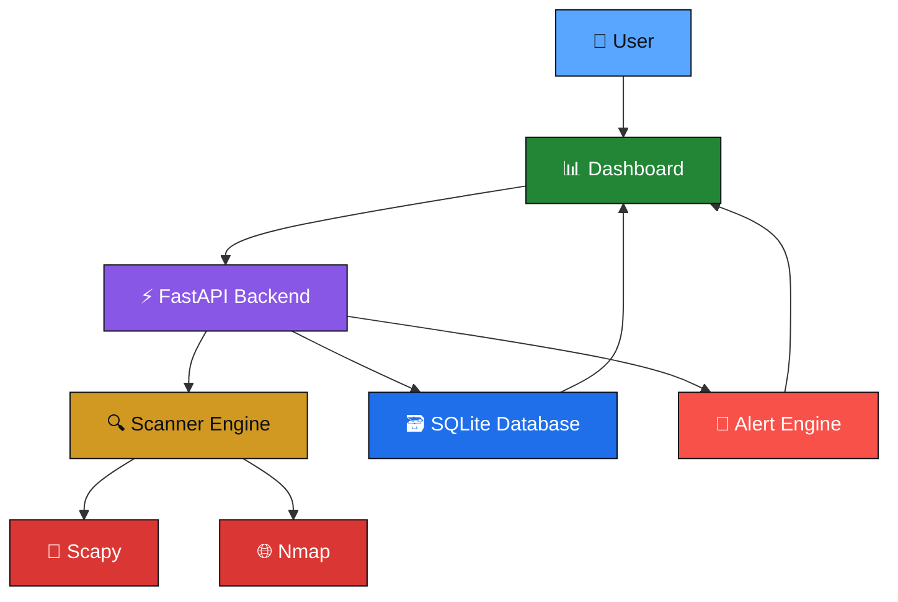
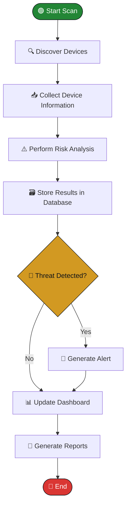

<div align="center">

# 🛡️ Net Sentinel
### Smart Network Monitoring System

**Real-time device discovery, risk analysis, and threat visibility for local networks.**


<br/>

[](https://www.python.org/)
[](https://fastapi.tiangolo.com/)
[](https://www.sqlite.org/)
[](https://developer.mozilla.org/en-US/docs/Web/HTML)
[](https://developer.mozilla.org/en-US/docs/Web/CSS)
[](https://developer.mozilla.org/en-US/docs/Web/JavaScript)
[](https://scapy.net/)
[](https://nmap.org/)

<br/>

[](https://github.com/yourusername/net-sentinel/stargazers)
[](LICENSE)
[](#)
[](https://github.com/yourusername/net-sentinel/commits/main)
[](#)
[](#)

</div>

<br/>

---

## 📌 Table of Contents

- [About the Project](#-about-the-project)
- [Key Features](#-key-features)
- [Screenshots](#-project-screenshots)
- [Architecture](#-project-architecture)
- [Workflow](#-project-workflow)
- [Folder Structure](#-folder-structure)
- [Technology Stack](#-technology-stack)
- [Installation Guide](#-installation-guide)
- [Usage](#-usage)
- [Applications](#-applications)
- [Roadmap](#-roadmap)
- [Future Scope](#-future-scope)
- [Contributors](#-contributors)
- [License](#-license)
- [Contact](#-contact)

---

## 🧠 About the Project

**Net Sentinel** is a **Smart Network Monitoring System** built to give individuals, students, and small organizations enterprise-grade visibility into their **Local Area Network (LAN)**.

Modern home and office networks host a growing number of connected devices — laptops, phones, IoT gadgets, printers, and guest devices — often with little to no oversight. Net Sentinel closes that visibility gap by continuously watching the network and translating raw packet and scan data into clear, actionable security insight.

The system automatically:

- 🔍 **Discovers** every device connected to the network in real time
- ❓ **Identifies unknown or unauthorized hosts** the moment they appear
- ⚠️ **Calculates a security risk score** for each device based on behavior and fingerprinting
- 🚨 **Generates alerts** for suspicious activity or new device connections
- 🗂️ **Maintains a full scan history** for auditing and trend analysis
- 📊 **Displays everything** through a clean, interactive, real-time dashboard

Net Sentinel is designed to be lightweight, extensible, and easy to run locally — making it equally useful as a **learning platform for cybersecurity students** and as a **practical monitoring tool for small networks**.

---

## ✨ Key Features

### ✅ Current Features

| Feature | Description | Status |
|---|---|:---:|
| 🖥️ Device Discovery | Automatically scans and lists all devices on the LAN | ✅ |
| 🕵️ Unknown Host Detection | Flags devices not previously seen on the network | ✅ |
| 📈 Risk Scoring Engine | Assigns a calculated risk level to each detected device | ✅ |
| 🚨 Real-Time Alerts | Notifies users of suspicious or new device activity | ✅ |
| 🗃️ Scan History | Stores historical scan data in a local database | ✅ |
| 📊 Interactive Dashboard | Visual, web-based interface for live monitoring | ✅ |
| ⚡ FastAPI Backend | High-performance REST API powering the system | ✅ |
| 📡 Packet-Level Analysis | Uses Scapy for low-level network packet inspection | ✅ |
| 🌐 Nmap Integration | Deep port and service scanning of discovered hosts | ✅ |

### 🚧 Future Features

| Feature | Description | Status |
|---|---|:---:|
| 🤖 AI-Based Threat Detection | Machine learning models for anomaly detection | 🔜 |
| 📧 Email Alerting | Automatic email notifications for critical events | 🔜 |
| 📄 PDF Report Generation | Exportable, shareable security reports | 🔜 |
| 🗺️ Network Topology Mapping | Visual graph of network layout and connections | 🔜 |
| 🐧 Linux Support | Full cross-platform compatibility | 🔜 |
| 🏷️ Vendor Fingerprinting | MAC-based device manufacturer identification | 🔜 |

---

## 🖼️ Project Screenshots

<details>
<summary><strong>📊 Dashboard</strong></summary>
<br/>


</details>

<details>
<summary><strong>💻 Device List</strong></summary>
<br/>


</details>

<details>
<summary><strong>🚨 Alerts Panel</strong></summary>
<br/>


</details>

<details>
<summary><strong>🗂️ Scan History</strong></summary>
<br/>


</details>

<details>
<summary><strong>📑 Reports</strong></summary>
<br/>


</details>

<details>
<summary><strong>🏗️ Architecture View</strong></summary>
<br/>


</details>

---

## 🏗️ Project Architecture



---

## 🔄 Project Workflow



---

## 📁 Folder Structure

```
net-sentinel/
│
├── 📂 backend/
│   ├── 📂 app/
│   │   ├── 📂 api/                 # FastAPI route definitions
│   │   ├── 📂 core/                # Core configuration & settings
│   │   ├── 📂 models/              # Database models (SQLAlchemy/SQLite)
│   │   ├── 📂 scanner/             # Scapy & Nmap scanning logic
│   │   ├── 📂 services/            # Risk scoring & alert logic
│   │   └── 📄 main.py              # FastAPI application entry point
│   ├── 📂 database/
│   │   └── 📄 net_sentinel.db      # SQLite database file
│   └── 📄 requirements.txt         # Python dependencies
│
├── 📂 frontend/
│   ├── 📂 css/                     # Stylesheets
│   ├── 📂 js/                      # Dashboard interactivity
│   ├── 📂 assets/                  # Icons, images, logos
│   └── 📄 index.html               # Dashboard entry point
│
├── 📂 reports/                     # Generated scan/security reports
├── 📂 docs/                        # Documentation & diagrams
├── 📂 tests/                       # Unit & integration tests
│
├── 📄 .env.example                 # Environment variable template
├── 📄 .gitignore
├── 📄 LICENSE
└── 📄 README.md
```

---

## 🧰 Technology Stack

| Category | Technologies |
|---|---|
| **Programming Languages** |   |
| **Frontend** |    |
| **Backend** |  |
| **Database** |  |
| **Networking & Scanning** |   |
| **Version Control** |   |
| **IDE** |  |
| **Operating System** |  (Linux support planned 🔜) |

---

## ⚙️ Installation Guide

### Prerequisites

- Python 3.10 or higher
- Nmap installed and added to system PATH
- Administrator/root privileges (required for packet-level scanning)

### Step 1 — Clone the Repository

```bash
git clone https://github.com/yourusername/net-sentinel.git
cd net-sentinel
```

### Step 2 — Create a Virtual Environment

```bash
python -m venv venv

# Activate on Windows
venv\Scripts\activate

# Activate on Linux/macOS
source venv/bin/activate
```

### Step 3 — Install Requirements

```bash
pip install -r backend/requirements.txt
```

### Step 4 — Run the FastAPI Server

```bash
cd backend
uvicorn app.main:app --reload --host 0.0.0.0 --port 8000
```

### Step 5 — Open the Dashboard

Open your browser and navigate to:

```
http://localhost:8000
```

---

## 🚀 Usage

| Action | How To |
|---|---|
| **Start a Scan** | Click **"Start Scan"** on the dashboard to trigger device discovery across the LAN |
| **View Devices** | Navigate to the **Devices** tab to see all discovered hosts with IP, MAC, and vendor info |
| **Monitor Alerts** | Open the **Alerts** panel to review flagged or suspicious activity in real time |
| **Check History** | Visit the **Scan History** tab to review past scans and track network changes over time |
| **Generate Reports** | Use the **Reports** section to compile and export scan/security summaries |

---

## 🏢 Applications

- 🏠 **Home Networks** — Monitor personal devices and detect unauthorized access
- 🏢 **Office Networks** — Maintain visibility over employee and guest devices
- 🎓 **Educational Labs** — Hands-on platform for teaching network security concepts
- 🏪 **Small Businesses** — Affordable network monitoring without enterprise tooling
- 🛡️ **Cybersecurity Learning** — Practical playground for students and self-learners

---

## 🗺️ Roadmap

### ✅ Completed
- [x] Core device discovery engine
- [x] FastAPI backend architecture
- [x] SQLite database integration
- [x] Interactive web dashboard
- [x] Basic risk scoring system
- [x] Real-time alert generation

### 🔄 In Progress
- [ ] Scan history analytics view
- [ ] Improved risk-scoring algorithm
- [ ] Report export (CSV)
- [ ] UI/UX refinement

### 🔮 Future
- [ ] AI-based threat detection
- [ ] Email alert notifications
- [ ] PDF report generation
- [ ] Network topology visualization
- [ ] Linux platform support
- [ ] Mobile-responsive dashboard enhancements

---

## 🔮 Future Scope

| Feature | Description |
|---|---|
| 🤖 **AI Threat Detection** | Apply machine learning to identify abnormal device behavior and emerging threats. |
| 📧 **Email Alerts** | Send automated email notifications when high-risk events are detected. |
| 📄 **PDF Reports** | Generate polished, exportable PDF summaries of scan and security data. |
| ⏱️ **Real-Time Monitoring** | Continuously track network activity without requiring manual scans. |
| 🗺️ **Network Topology** | Visualize how devices connect and communicate across the network. |
| 🖥️ **Operating System Detection** | Identify the OS running on each connected device. |
| 🔓 **Open Port Detection** | Highlight potentially risky open ports on scanned hosts. |
| 📶 **Traffic Monitoring** | Analyze bandwidth usage and traffic patterns per device. |
| 🏷️ **Vendor Detection** | Resolve device manufacturers from MAC address prefixes. |
| 🐧 **Linux Support** | Extend full compatibility to Linux-based systems. |

---

## 👥 Contributors

<div align="center">

Thanks to everyone who has contributed to making **Net Sentinel** better.

<a href="https://github.com/yourusername/net-sentinel/graphs/contributors">
  
</a>

Want to contribute? Pull requests are welcome!
Please open an issue first to discuss proposed changes.

</div>

---

## 📜 License

This project is licensed under the **MIT License** — see the [LICENSE](LICENSE) file for details.

```
MIT License © 2025 Net Sentinel Contributors
Permission is granted, free of charge, to use, copy, modify, and distribute this software.
```

---

## 📬 Contact

<div align="center">

[](https://github.com/yourusername)
[](https://linkedin.com/in/yourprofile)
[](mailto:your.email@example.com)

<br/>

⭐ **If you find this project useful, consider giving it a star!** ⭐

