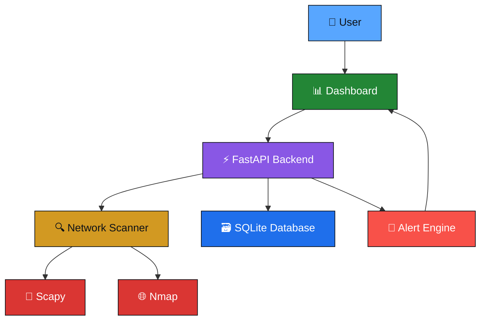

<div align="center">

# 🛡️ Net Sentinel
### Smart Network Monitoring System

**A college engineering project focused on monitoring and securing Local Area Networks.**


<br/>

[](https://www.python.org/)
[](https://isocpp.org/)
[](https://fastapi.tiangolo.com/)
[](https://developer.mozilla.org/en-US/docs/Web/HTML)
[](https://developer.mozilla.org/en-US/docs/Web/CSS)
[](https://developer.mozilla.org/en-US/docs/Web/JavaScript)
[](https://www.sqlite.org/)
[](https://git-scm.com/)

</div>

<br/>

> ⚠️ **This repository is a work in progress.** Features, structure, and setup steps are actively changing as development continues. This README will be updated regularly to reflect the project's real status.

---

## 📌 Table of Contents

- [About the Project](#-about-the-project)
- [Current Development Status](#-current-development-status)
- [Planned Features](#-planned-features)
- [Development Roadmap](#-development-roadmap)
- [Technology Stack](#-technology-stack)
- [Planned Architecture](#-planned-architecture)
- [Repository Structure](#-repository-structure)
- [Installation](#-installation)
- [Contributors](#-contributors)
- [Future Scope](#-future-scope)
- [License](#-license)

---

## 🧠 About the Project

**Net Sentinel** is a **Smart Network Monitoring System** being developed as a cybersecurity engineering college project. The goal of the project is to build a tool that helps monitor and secure **Local Area Networks (LANs)** by giving users visibility into the devices and activity on their network.

The project aims to:

- 🔍 Discover devices connected to the network
- 📡 Monitor basic network activity
- ❓ Detect unknown or previously unseen devices
- 🗃️ Store scan history for later review
- 🚨 Generate security alerts for suspicious activity
- 📊 Provide a simple web dashboard to visualize this information

**This project is currently under active development, and new features are being added gradually.** It is being built and maintained by a small team of engineering students as part of our coursework, with the intention of learning practical cybersecurity and full-stack development skills along the way.

---

## 📊 Current Development Status

| Milestone | Status |
|---|:---:|
| Project Planning | ✔️ Done |
| Repository Setup | ✔️ Done |
| Technology Selection | ✔️ Done |
| Backend Development | 🔄 In Progress |
| Frontend Development | 🔄 In Progress |
| Database Integration | 🔄 In Progress |
| Alert System | 🔄 In Progress |
| Testing | ⏳ Not Started |
| Documentation | 🔄 In Progress |
| Final Deployment | ⏳ Not Started |

*Legend: ✔️ Done · 🔄 In Progress · ⏳ Not Started*

---

## ✅ Planned Features

> The list below reflects what the project intends to build. Items marked **In Progress** are being actively worked on. Everything else is planned for later stages and **is not yet implemented**.

- [ ] 🔄 Device Discovery *(In Progress)*
- [ ] 🔄 Network Scanner *(In Progress)*
- [ ] 🔄 Web Dashboard *(In Progress)*
- [ ] 📋 Risk Analysis *(Planned)*
- [ ] 📋 Alert System *(Planned)*
- [ ] 📋 SQLite Database Integration *(Planned)*
- [ ] 📋 OS Detection *(Planned)*
- [ ] 📋 Open Port Detection *(Planned)*
- [ ] 📋 Traffic Monitoring *(Planned)*
- [ ] 📋 Network Topology Mapping *(Planned)*
- [ ] 📋 PDF Reports *(Planned)*
- [ ] 📋 Email Alerts *(Planned)*
- [ ] 📋 AI-Based Threat Detection *(Planned)*

---

## 🗺️ Development Roadmap

<details open>
<summary><strong>Phase 1 — Foundation ✔️</strong></summary>
<br/>

- Project planning and scope definition
- Technology stack selection
- Repository setup and initial structure

</details>

<details open>
<summary><strong>Phase 2 — Core Backend 🔄</strong></summary>
<br/>

- Backend development with FastAPI
- Database design (SQLite)
- Basic network scanner implementation

</details>

<details>
<summary><strong>Phase 3 — Dashboard & Alerts ⏳</strong></summary>
<br/>

- Dashboard development (frontend)
- Alert engine implementation
- Initial testing and bug fixing

</details>

<details>
<summary><strong>Phase 4 — Advanced Features ⏳</strong></summary>
<br/>

- Advanced scanning features (OS/port/traffic)
- AI-based threat detection
- PDF/report generation
- Deployment preparation

</details>

---

## 🧰 Technology Stack

| Category | Technologies |
|---|---|
| **Programming Languages** |   |
| **Frontend** |    |
| **Backend** |  |
| **Database** |  |
| **Networking** |   |
| **Development Tools** |    |

---

## 🏗️ Planned Architecture

> The diagram below represents the **planned system design**. It is a target architecture and does not yet reflect a fully implemented system.



---


---

## ⚙️ Installation

> ⚠️ **Note:** Since the project is under active development, setup steps may change frequently. Please check back for updates before relying on these instructions.

### Prerequisites

- Python 3.10 or higher
- Git

### Steps (current, subject to change)

```bash
# 1. Clone the repository
git clone https://github.com/manishburdak45/NetSentinel-Smart-Network-Monitoring-System
cd net-sentinel

# 2. Create a virtual environment
python -m venv venv

# Activate on Windows
venv\Scripts\activate

# Activate on Linux/macOS
source venv/bin/activate

# 3. Install dependencies
pip install -r backend/requirements.txt

# 4. Run the development server
cd backend
uvicorn app.main:app --reload
```

The application is not yet feature-complete, and some modules referenced above are still being built.

---


</div>

This project is developed and maintained as part of an academic cybersecurity engineering course. Contributions, suggestions, and feedback from peers and mentors are welcome.

---

## 🔮 Future Scope

Once the core system is stable, we plan to explore the following enhancements:

- **AI-Based Threat Detection** — using basic machine learning to flag abnormal device behavior.
- **Email Alerts** — notifying users automatically when suspicious activity is detected.
- **PDF Reports** — exporting scan and alert summaries for record-keeping.
- **Network Topology Mapping** — visualizing how devices are connected.
- **OS and Open Port Detection** — deeper fingerprinting of discovered devices.
- **Traffic Monitoring** — tracking bandwidth usage per device.
- **Linux Support** — extending compatibility beyond Windows.

These are long-term goals and will only be pursued once the core monitoring functionality is complete and stable.

---

## 📜 License

This project is licensed under the **MIT License** — see the [LICENSE](LICENSE) file for details.

---

<div align="center">

🚧 **Thanks for checking out Net Sentinel.** Since this project is still early in development, feedback and suggestions are genuinely appreciated. 🚧

</div>
